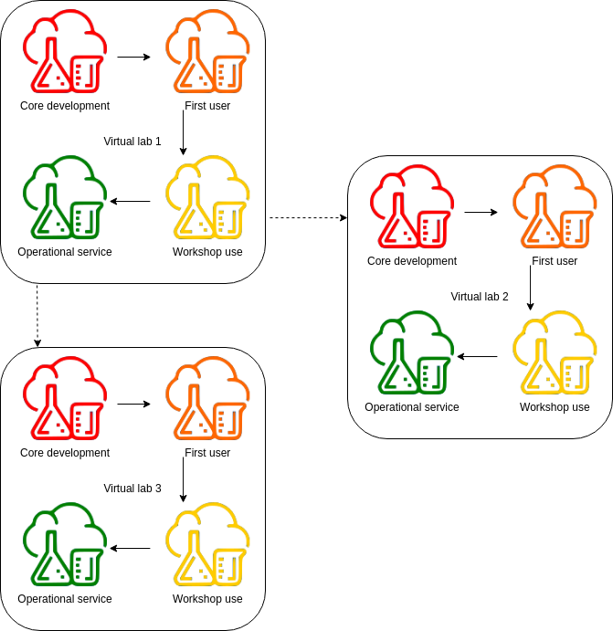

# Readiness level framework for virtual labs in NaaVRE

This draft version contains some revision questions, which are marked in green.

Version 1.0.0

NaaVRE facilitates data processing, data analysis, and simulation by enabling scientists to create their own virtual labs.
A collaborative effort between ecosystem specialists, computational scientists, data scientists, and development and operations engineers 
ensures that virtual labs are optimized to support research effectively.
Virtual labs evolve through distinct stages: Initially, development is the primary focus. As the lab matures, 
it transitions to support a first user, and ultimately, multiple users can conduct experiments within the environment.  

This readiness level framework assists researchers in building virtual labs by:
- Defining the content of virtual labs. 
- Describing the roles involved in the development and use of a virtual lab.
- Describing the progression of a virtual lab through readiness levels, highlighting requirements, milestones and responsibilities.

## Content of a virtual lab
A virtual lab is a collection of items researchers need to conduct their experiments: 
- Assets created in the virtual lab. 
- Documents that support the usability of the virtual lab.

Three types of assets can be created in a virtual lab:
- The codebase: Any code written for the virtual lab. The codebase interacts with external resources such as software libraries and external data.
- Internal data: Produced in the virtual lab by data processing, data analysis, and simulations.
- Containerized cells and workflows.

Besides assets, we encourage the developers of a virtual lab to create documents that aid the FAIRness and maintenance of the virtual lab:
- Metadata.
- Documentation, including a tutorial.

## Virtual lab roles
NaaVRE aims to be a virtual research environment (VRE) that enables experts in computational ecology and ecological data analysis
to create virtual labs.
Our platform needs contributions from the multiple roles to enable innovative research methods. Some people will only have 
one role for the virtual lab, while others might have multiple of the following roles:
- Virtual lab development roles: Roles involved in the creation of a new virtual lab.
  - Virtual lab owner / Principal investigator: Coordinates the development of the virtual lab with a scientific vision.
  This will often be the golden user, i.e. the person that provides the initial publishable use case of the virtual lab. 
  - Virtual lab core developers: Develop a new virtual lab in NaaVRE. Often the virtual lab owner will be one of the core developers. 
  - Virtual lab code reviewers: Provide feedback during core development on the user-friendliness, maintainability, and robustness of the
  source code and other assets.
- Virtual lab usage roles: Roles of people who use an existing virtual lab for their own research.
  - Virtual lab user: Researchers that couple virtual labs assets, and run their own scenarios in the virtual lab by using their own data and parameters.
  - Virtual lab asset developer: Users who, besides coupling assets and running scenarios, expand and adapt the source code 
  within their own copy of the virtual lab to suit their needs. In the virtual labs the distinction between development 
  and use is a continuum. How many changes a scientist will make to the codebase and libraries depends on whether the virtual lab already has the necessary assets for the user.
  - Virtual lab visitor: Visits the virtual lab to see how experiments were done and what is possible in the virtual lab.
- Virtual lab support roles: Roles to support development and use of virtual labs.
  - Virtual lab trainer: Knows the lab from a user viewpoint and provides trainings to new users. This role will often be assigned to a person who is also the virtual lab owner, a core developer, or service operator. 
  - Virtual lab technical coordinator: Knows the lab from a technical perspective and pushes the lab to the next readiness level. Often, this will be an employee at LifeWatch ERIC VLIC
  - Virtual lab service operator: Can support users. Knows the potential and limitations of the lab and can help out when problems arise.  
  - Virtual research environment development and operations (VRE DevOps) engineer: Maintains NaaVRE. Often, this will be an employee at LifeWatch ERIC VLIC.
  - Networked infrastructures scientist: Contribute state-of-the-art components to the NaaVRE and can publish technical papers 
  that demonstrate the relevance of NaaVRE in the field of networked systems.

## Readiness levels
We discern four readiness levels in the development of a virtual lab. 
For each higher readiness level improvements are be made to the assets and documents in order to make the lab usable by others 
with an increasing amount of independence from the virtual lab core developers and VRE DevOps team.

1. Core Development: Core development is the initial phase where all virtual labs start off. This is the beginning of the 
development of new data processing, data analysis, or simulation tools or the conversion of legacy code from a different platform to NaaVRE.
2. First use: The virtual lab owner uses the virtual lab to run their scenarios.
3. Workshop use: The lab can be used by multiple workshop participants under the guidance of the virtual lab trainer. 
4. Operational service: The virtual lab is ready for all scientists to create their own instance of the lab for their research.

The following table gives indications of the duration, number of developers and users involved per readiness level.

| Readiness level     | Duration   | Developers                  | Users | Context dissemination | 
|---------------------|------------|-----------------------------|-------|-----------------------|
| Core development    | 3-6 months | the core development team   | 0     | Metadata publication  | 
| First use           | 3 months   | the core development team   | 1     | Paper publication     |
| Workshop use        | 3 months   | 10-25 workshop participants | 10-25 | Workshops             |
| Operational service |            | 10 ≤ asset developers       | ≥ 10  |                       |

### Starting core development
We recommend to start the creation of a new virtual lab by doing the following:
- Version control
  - Store the codebase on a repository with version control (e.g. git).
- Security
  - Make sure personal tokens for APIs do not end up in version control. ToDo Vlic: Guideline for secret management https://github.com/QCDIS/projects_overview/issues/276
- Licensing
  - Choose a license for the virtual lab. We recommend using the [Apache license 2.0](https://choosealicense.com/licenses/apache-2.0/), 
assuming this is compatible with the other packages and software you use in the virtual lab. If the Apache License 2.0 is incompatible with software or libraries used, 
you can pick another license. We recommend having a look at https://choosealicense.com/.
- Documentation
  - Pick a nice name for your virtual lab. Make sure the name won't be mixed up with other virtual labs.
  - Publish virtual lab metadata outside the virtual lab. This will allow others to be aware of the context of the virtual lab from an early stage.
ToDo: Check if we have a single preferred metadata catalogue.
    - Track the metadata with version control, such that the changes to metadata can be viewed by virtual lab users.
    - ToDo VLIC: Choose a metadata standard. 
 
### During core development
Where possible, do the following while building the virtual lab:
- Versioning
  - Pin versions of used software and libraries in the dependencies to prevent compatibility problems when updates occur to the packages and software.                                                                                                                                                                                              
- Start each cell in the notebook with a title.
- Data
  - Store data that is only read by the virtual lab in an external catalogue and use an API to access this data.
- Parallelization
  - Parallelize the execution of the parts of the code where this is useful. A tutorial is available [here](https://github.com/QCDIS/lifewatch-notebooks/blob/main/NaaVRE-tutorials/splitting-classic.ipynb).
- Documentation
  - Create documentation for the virtual lab.
    - Track the documentation with version control.

#### Core development responsibilities
The following roles should be assigned during core development:
- Virtual lab owner / Principal investigator: Provides the use case that will be the first application of the virtual lab. 
Guides the development of the lab from the scientific viewpoint. 
- Virtual lab core developers: One or multiple core developers create a new virtual lab in NaaVRE.
- Virtual lab code reviewer: Provides feedback on the user-friendliness, maintainability, and robustness of the
source code and other assets. We recommend starting with reviews early on in the development process, as this may contribute to a clear architecture, and good code quality.
- Virtual research environment (VRE) development and operations engineers: Support the creation of the new virtual lab 
by giving the core development team advice and changing the virtual research environment where necessary.

#### Core development milestone
The milestone to reach during core development is a demonstration of a running the workflow in the virtual lab.

### From core development to first use
A usability study should be done to determine if the lab is ready for its first use. The usability study should look at least at the following criteria:
- Security
  - Personal tokens are not tracked by version control.
- Licensing
  - The virtual lab has a license.
- Versioning
  - Versions of used software and libraries are pinned. 
- Metadata
  - The metadata of the virtual lab is published.
- Codebase
  - The code executes without errors: The code can be executed without errors. 
Currently, you can verify this by manually executing all cells in the notebook on a machine on which the code was not developed (to ensure no references are made to local resources).
  - The responsibility of each cell in the notebook is clear and can be described in a single sentence.
- Parallel processing is applied where suitable.
- Containerization
  - The notebook cells can be containerized.
- Workflow execution
  - The containerized cells can run without any modifications.

### During first use
Besides running scenarios in the virtual lab, the following should be done per category during first use:
- Data
  - Make data fair.
- Scenarios
  - Make sure and describe how the virtual lab can be used on different scenarios.
- Versioning
  - Add a version number to the virtual lab so users can refer to this number when they are reporting reproducibility or bug issues. 
  - Give each containerized cell a persistent identifier and version number (This is currently not a feature in NaaVRE. But might become possible in the future. Added to [potential ToDos](#potential-todos-for-lifewatch-vlic))
- Documentation
  - Create a [user manual](#User-manual) for the virtual lab.
- Metadata
  - Complete all metadata fields
- Codebase
  - Add unit tests to verify the behavior of used methods and libraries.
  - Define clear responsibilities of all notebook cells, methods and classes.

#### First use Milestones
Two papers should be published:
1. A paper in the ecosystem domain presenting the scenarios run in the virtual lab.
2. A technical paper.  

Additionally the virtual lab should be made publicly available.

#### First use responsibilities
The following roles should be assigned during first use:
- Virtual lab owner / Principal investigator: Uses the virtual lab to do their research. Publishes a paper in the ecosystem domain.
- Virtual lab core developers: Provide support to the virtual lab owner.
- Networked infrastructures scientist: Publishes a technical paper.
- Virtual lab trainer: Once the virtual lab owner, and reviewers believe the virtual lab to be ready to be used by others,
the virtual lab trainer tries out the virtual lab and makes suggestions. Helps the virtual lab owner identify issues arising when others start using the virtual lab.
- VRE DevOps engineer: Support the core developers and golden user by providing advise and changing the virtual research environment where necessary.

### From first use to workshop use
The virtual lab is ready for workshop use, if it meets the criteria for first use, and additionally meets the following requirements:
- Metadata
  - All the fields of the metadata standard are present. 
- Scenarios
  - The virtual lab can be used in multiple scenarios, i.e. both the parameters and datasets can be changed to suit experiments of different researchers.
- Documentation
  - At least one domain scientist who was not involved in the development of the virtual lab has reviewed the user manual. 
The coding experience of the reviewer of the user manual is similar to the coding experience of the intended user.
  - How to use the virtual lab on a different scenario is explained.
- Codebase
  - Unit tests verify the behavior of used methods and libraries. There should be a testing guideline, which will be done in this issue [\#274](https://github.com/QCDIS/projects_overview/issues/274).
  - The virtual lab reads, writes and exchanges data in a way that meets domain-relevant community standards. [5] I think we will need to consult some ecologists to determine these standards. I aditionally emailed Nafiseh.                                                                                                                                                                                                                                                                                                          
  - The code within cells is easily human-readable and others can easily modify it. If methods have side effects, this is clear to the user.
  - The input and output of each cell is clear. It is both clear what the structure is (e.g. what data type is used) and what the data content is from a domain perspective.
- Workflow
  - The duration of computation, memory usage, and power usage of the container is acceptable. As there is currently no dashboard to monitor resource usage, contact the VLIC team for guidelines.
- Infrastructure
  - The infrastructure requirements for the workshop are known and the necessary infrastructure has been provided:
    - The number of people taking part in a workshop.
    - The random access memory and permanent storage usage of the virtual lab are known. 
    - The amount of processors the virtual lab uses is known.

### During workshop use
The following should be done during workshop use:
- Documentation
  - Gather user feedback on the documentation.
- Codebase
  - Find out if the architecture of the virtual lab is understandable and maintainable.

#### Workshop use milestone
In this phase at least one workshop should be given to a group of 10 to 25 potential users. 
Additionally, user feedback should be gathered and processed.

#### Workshop use responsibilities
The following responsibilities should be assigned during workshop use:
- Virtual lab owner / Principal investigator: Gathers user feedback and determines how to facilitate other users in the virtual lab.
- Virtual lab trainer: Gives trainings to users. Can point out what the user can change and can not change in the lab.
- Virtual lab technical coordinator: Answers any technical questions arising from the workshop use which the trainer can not answer. 
Has been involved as VRE DevOps engineer during the previous stages.

### From workshop use to operational service
The virtual lab is an operational service if all previous criteria apply and additionally the following criteria apply:
- Dependencies are specified. The dependencies are in the dockerfile of the virtual lab, 
but should be duplicated in the metadata such that a person can in theory also run the source code on their own machine after installing the dependencies manually.
- Deploy the virtual lab on MyLifeWatch.

### During operational service
The following should be done during operational service:
- Expand and adapt the virtual lab where useful or necessary.
- Make the containerized cells and workflow interoperable with other systems where use cases for the interoperability between NaaVRE and another system arise.

#### Operational service milestones
The following milestones can occur when a virtual lab runs as an operational service:
- Users of the virtual lab successfully run their own scenarios in the virtual lab.
- Virtual lab developers make their own modifications to the virtual lab to facilitate their research.
- Users come up with ideas that spawn the creation of a new virtual lab:
Whenever users of the virtual lab come up with a new idea that does not fit in the possibilities of existing virtual labs, 
they can contact LifeWatch to discuss the possibilities of creating a new virtual lab.

#### Operational service responsibilities
The following responsibilities should be assigned when the virtual lab is an operational service:
- Virtual lab owner / Principal investigator: Coordinates the further development of the virtual lab with a scientific vision. 
- Virtual lab service operator: Is the primary point of contact in case any problems arise with the virtual lab.
- Virtual lab technical coordinator: Ensures the VRE keeps supporting the virtual lab.

  
Figure1: The virtual lab moves through the readiness levels, from core development to operational service. Users coming up with ideas for new experiments that do not fit in the virtual lab, 
can in collaboration with LifeWatch create a new virtual lab that fits their needs.  
Should we use the virtual lab logo instead of the NaaVRE logo? So the Erlenmeyer, beaker and cloud?

### User manual
The following guidelines can be used to determine the completeness of a user manual.
- The virtual lab is explained from the following viewpoints:
  - A conceptual viewpoint. There is an intuitive description of what happens.
  - A mathematical viewpoint. How the real world system relates to the used mathematical algorithm is clear.
  - A computational viewpoint: How the algorithm is converted into computational methods is explained.
  - An engineering viewpoint: There is a description of the software architecture of the virtual lab.
- The parameters are clear.
    - It is clear what the ecological meaning of the parameter is.  
    - It is clear how to change these parameters.
- There is a tutorial: Virtual lab developers are strongly encouraged to create a tutorial for virtual labs early on in the development. In the simplest case, this is the existing main notebook with a description of the processes that occur during execution.  
  - The tutorial can be done without supervision.
- Known potential pitfalls in using the virtual lab are described.
- There is a description of the standards used for data exchange with application programming interfaces and databases.
- Storage location 
  - Store the user manual for the virtual lab in the same git repository as the virtual lab assets.
  - The user manual will be made available on [NaaVRE.net](https://naavre.net/) and should be separated from the codebase.
  - Instructions on how to use a single notebook can be stored in the markdown of that notebook.

## Sources
- These recommendations are partially based on ideas presented in the paper [Introducing the FAIR Principles for research software](https://www.nature.com/articles/s41597-022-01710-x), the [Fair software checklist](https://fairsoftwarechecklist.net/v0.2/), and [fair-software.eu](https://fair-software.eu/recommendations/license).

## Potential ToDos for LifeWatch VLIC
To be able to cycle through the entire readiness cycle described here, LifeWatch VLIC needs to finish the following: 
- Make NaaVRE generate a persistent identifier and version number for containerized cells. See [Containerized cells and Workflow](#containerized-cells-and-workflow).
- Software management plan: Shall we focus on getting a readiness level framework which mentions a software management plan, and work out the details of what should be in the [software management plan](https://zenodo.org/records/7248877) later?
- Choose a metadata standard for Virtual labs.  https://github.com/QCDIS/projects_overview/issues/275
- Create recommendations for testing: https://github.com/QCDIS/projects_overview/issues/274
- Guideline for secret management https://github.com/QCDIS/projects_overview/issues/276
- Determine a way of structuring files in a virtual lab git repository that allows publication of the user manual and documentation on NaaVRE.net.  https://github.com/QCDIS/projects_overview/issues/279

## Feedback
Any feedback on this document is appreciated. Please contact the LifeWatch VLIC team if you have any questions or comments on the document.